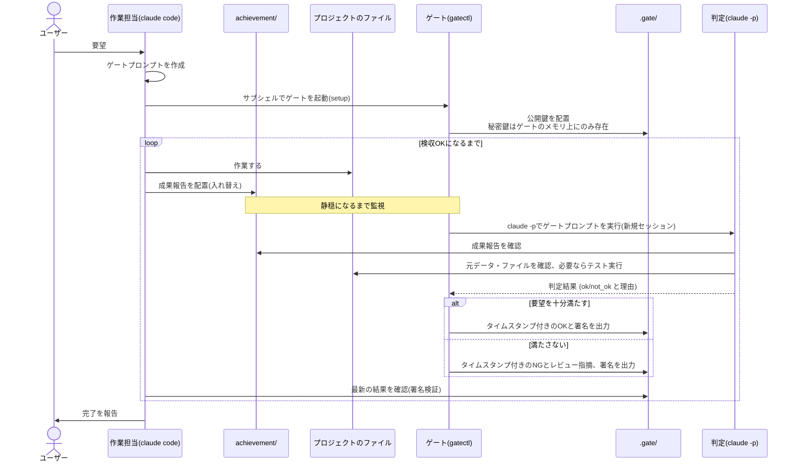

# whatever-it-takes

ユーザー要望に取り組む前に**検収ゲート**を立て、検収がOKを出すまで作業を続けるためのClaude Codeスキルです。

検収ゲートには2つのモードがあります。
**mechanicalモード**は、終了コードで合否が決まるコマンド（`pytest`や`go test`など）を使います。
**claudeモード**は、独立したclaude codeセッションに判定させます。
どちらを選ぶかはユーザー要望次第です。
claudeモードの結果にはed25519で署名を付け、作業担当のセッションによる結果の書き換えや、うっかりした捏造を防ぎます。

claudeモードの判定担当（`claude -p`）は、毎回まっさらなセッションで動き、前回の検収の文脈を引き継ぎません。
使うプロンプトも、検収ゲートの起動時に読み込んだメモリ上のコピーだけです。
setup後にプロンプトファイルを書き換えても、判定には反映されません。

検収のタイミングも、固定間隔のタイマーには頼りません。
claudeモードでは、作業担当が成果報告を置く`achievement/`ディレクトリの変更が止まってから検収します。
作業の途中、ファイルが壊れた中間状態にあるときに検収してしまうのを避けるためです。

作業担当のセッションが検収OKの前に完了を宣言しようとすると、Claude Codeの
フックの仕組みがそれを止め、作業を続けさせます。守るべきルールは指示として
書くだけでなく、この仕組みでも裏打ちしています。

claudeモードでの処理は次のとおりです(ディレクトリ名は変更できます)。



## 前提条件

bash（mechanicalモードのコマンド実行に使います）、claude CLI（claudeモードのみ）が必要です。
linux/darwinのamd64/arm64以外のプラットフォームでは、Go 1.21以上も必要です。

## セットアップ

`install.sh`を実行すると、個人用（`~/.claude/skills/`）かプロジェクト用（`.claude/skills/`）かを対話的に選べます。

```bash
curl -fsSL https://raw.githubusercontent.com/kazufusa/whatever-it-takes-skill/main/install.sh | bash
```

sudo権限は使いません。

## 使い方

`/whatever-it-takes`で呼び出せます。
「検収ゲートを立てて」「OKが出るまで直して」のような依頼でも、自動的に使われます。
実際の進め方はSKILL.mdにあります。

## セキュリティ設計

署名で防いでいるのは、結果ファイルの書き換えや、うっかりした捏造です。
作業担当と検収ループが同じOSユーザーで動く環境では、/proc経由で秘密鍵を積極的に読みにいく行為までは防げません。
強い保証が必要な場合は、検収ループを別のOSユーザーやホストで動かしてください。
詳しくはSKILL.mdの「検収ゲートの設計指針」を参照してください。

mechanicalモードには署名がありません。
決定的なコマンドは、疑わしければ誰でもその場で再実行して確かめられるためです。

## 既知の制約

- 検収は最初のOKで停止します。継続的な監視はしません。
- 検収結果は、直近の一定件数だけ保持されます。
- ファイルの変更検知には数秒〜数十秒の遅延があります。
- 検収ゲートの起動後は、対象のプロジェクトディレクトリを移動したり削除したりしないでください。
- 完了宣言を止める仕組みは、10回連続でブロックされたあと、次の試行で停止を許可します。無限ループを避けるための安全弁です。
- `achievement/`はclaudeモードだけで使います。名前は`setup`の`--achievement-dir`で変えられます。
- 対応プラットフォームはlinux/darwinのamd64/arm64だけです。それ以外では、Go 1.21以上でのビルドが必要です。
