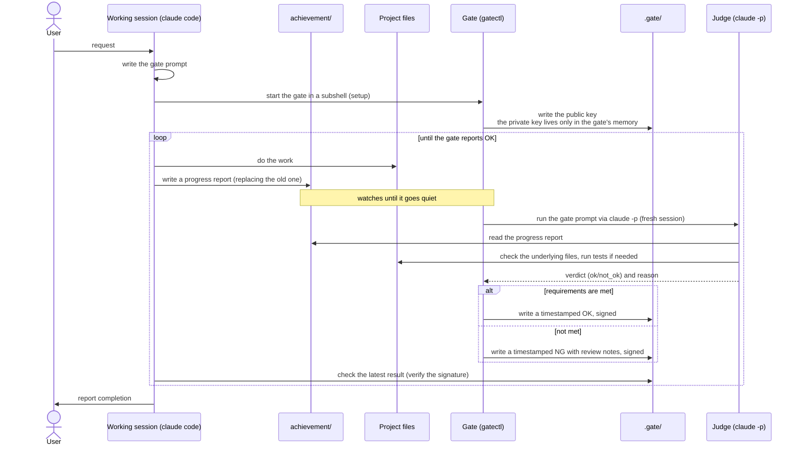

# whatever-it-takes

A Claude Code skill: set up an **acceptance gate** before starting work, and keep working until it reports OK.

The acceptance gate has two modes.
**Mechanical mode** uses a command whose exit code decides pass or fail (`pytest`, `go test`, etc.).
**Claude mode** has an independent claude code session act as judge.
Which one to use depends on the user's request.
Claude-mode results are signed with ed25519, which prevents the working session from rewriting or casually fabricating them.

The claude-mode judge (`claude -p`) runs a fresh session every time; it never carries over context from a previous check.
The prompt it uses is also a fixed, in-memory copy read once when the gate starts.
Editing the prompt file after setup has no effect on the judge.

Gate timing doesn't rely on a fixed interval either.
In claude mode, the gate checks once the `achievement/` directory — where the working session drops its progress report — stops changing.
This avoids checking mid-edit, while the code is in a broken intermediate state.

If the working session tries to declare completion before the gate reports OK, a Claude Code hook blocks it and forces the session to keep working.
The rule isn't only written as an instruction; this mechanism backs it up too.

Here's the claude-mode flow (directory names can be changed):



## Prerequisites

Requires bash (used to run mechanical-mode commands) and the claude CLI (claude mode only).
On platforms other than linux/darwin amd64/arm64, Go 1.21+ is also required.

## Setup

Running `install.sh` lets you choose interactively between a personal install (`~/.claude/skills/`) or a project install (`.claude/skills/`).

```bash
curl -fsSL https://raw.githubusercontent.com/kazufusa/whatever-it-takes-skill/main/install.sh | bash
```

It never uses sudo.

## Usage

Invoke it explicitly with `/whatever-it-takes`.
It's also used automatically for requests like "set up an acceptance gate" or "keep fixing this until it passes."
The actual workflow lives in SKILL.md.

## Security design

Signing protects against rewritten result files and casual fabrication.
In an environment where the working session and the gate loop run as the same OS user, it doesn't stop someone from deliberately reading the private key via `/proc`.
For a stronger guarantee, run the gate loop as a separate OS user or on a separate host.
See "Acceptance gate design guidelines" in SKILL.md for details.

Mechanical mode has no signing.
A deterministic command doesn't need it: anyone who doubts the result can just rerun `check-cmd` themselves.

## Known limitations

- The gate stops at the first OK. It doesn't keep monitoring afterward.
- Only a limited number of recent results are kept.
- File-change detection has a delay of a few seconds to a few tens of seconds.
- Don't move or delete the project directory once the gate has started.
- The mechanism that blocks premature completion allows the session to stop after 10 consecutive blocks, as a safety valve against infinite loops.
- `achievement/` is used in claude mode only. Its name can be changed with `setup`'s `--achievement-dir`.
- Prebuilt binaries only cover linux/darwin on amd64/arm64. Other platforms need a local build with Go 1.21+.
